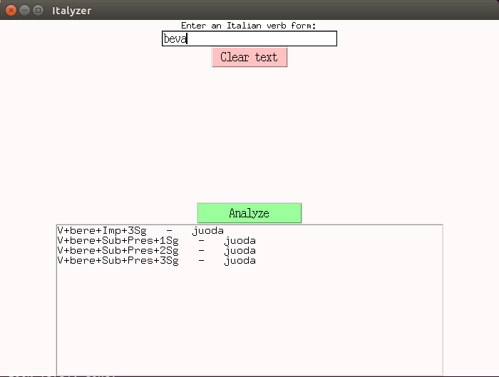

# Italyzer: Analyzer for Italian verbs

### Table of Contents
  * [Requirements](#Requirements)  
  * [Introduction](#Introduction)  
  * [Analyzer](#Analyzer)  
  * [User interfaces](#User%interfaces)

## Requirements

All dependencies can be installed via:

```bash
pip install -r requirements.txt
```

## Introduction

This my final project for the course Morphological Processing Tools 2 (Spring 2017). The main idea for this project was to create an analyzer, which would produce analyses of Italian verb forms. I wanted to use the tools we got acquainted with during the previous course of morphological processing tools (hfst, xfst, lexc, etc.). The aim was to have the analyzer to cover most Italian verbs, and also to create a simple user-interface for playing around with it.  

## Analyzer

The analyzer itself is an [hfst](https://en.wikipedia.org/wiki/HFST) transducer file compiled from an [xfst](http://cs.haifa.ac.il/~shuly/teaching/06/nlp/xfst-tutorial.pdf) file and a [lexc](https://kitwiki.csc.fi/twiki/bin/view/KitWiki/HfstLexcAndTwolcTutorial) file. For the lexc file, I searched online for any Italian verb lists I could find, majority of them being from an Italian verb Wiktionary site. Currently, there are about 6000 in the lexicon. I made a few Python scripts to divide them into different conjugations; -are, -ere-, -ire and -isc (*more about Italian conjugation* [here](https://en.wikipedia.org/wiki/Italian_conjugation)), and to format them into the lexc format.  

After the root lexicon, each of the four conjugations have their own lexicon for their stems from which the path divides further into mood, tense and person lexicons. *The transducer covers almost all of the forms that consist of one word, so it doesn’t recognize whether the form is in passive voice, because that would require an auxiliary verb as well.* I also decided not to include reflexive verbs (ending with -arsi, -ersi or -irsi), Latin derived -arre, -orre and -urre verbs, or forms consisting of a verb stem and an object pronoun (e.g. capirla) in the lexicon, since I wanted to focus on having most verbs in the four “main” conjugations inflected correctly.
  
Hundreds of the verbs are irregular or at least semi-irregular. The semi-irregular verbs (e.g. the ones that are irregular only in the absolute past tense) are handled by [flag-diacritics](http://giellatekno.uit.no/doc/lang/sme/docu-sme-flag-diacritics.html). For example, the stem of a verb that is irregular only in participle past forms, is marked with a `@P.IRREG_PTCPL.PAST@` flag-diacritic to block the path that leads to the regular participle past endings. Instead, the irregular participle past forms are stored in their own lexicon. Using a [list] 
(https://it.wikipedia.org/wiki/Verbi_irregolari_italiani) from Wikipedia I could divide some of the irregular verbs into groups that are inflected in the same way. But in many cases when a verb is highly irregular, most of the forms are written separately and grouping is not possible.

## User interfaces
There are two user interfaces, a **text-based** and a **graphical**.  
<br/>

  
<br/><br/><br/><br/><br/><br/><br/><br/><br/><br/><br/>
They are both made with Python and they use the [HFST Python API](https://pypi.org/project/hfst/). The UIs take a verb form as input and attempt to call the transducer. If recognition succeeds, the proper parse is shown in the output (or output box in the GUI).
If recognition fails, the word suggester is used. The word suggester is a Python script that processes the user input and tries to create a list of similar existing word forms. It uses a list of all possible word forms (~270 000 currently) and generates a list of actual forms that are one or two edits away from the user input, and then displays them. With the GUI, user can select any suggestion from the list by clicking it, and in the text-based, user can type the displayed number of a suggested form to see its analysis. Suggestions are displayed for input that is longer than 2 characters, the ones that are only 1 edit away from the input being first. There are currently no weights to determine which of the suggestions is closest on keyboard.


